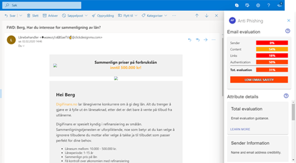
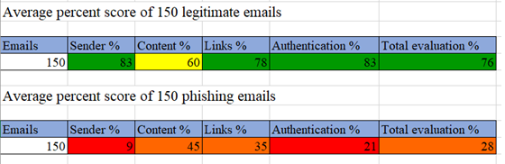

# Email phishing detection application

This repository contains files used in the development of an email phishing detection application. The application was developed in Microsoft's Office Outlook add-in environment to be able to run on Outlook Live (www.outlook.com).

## Result

The application has the following functionailties:

1.  Routing between application pages
2.  GUI for accessing functionalities
3.  User manual
4.  Percent score system for rating section’s functionalities
5.  Sender section:
    - Fetching sender’s display name and email address
    - Comparing similarities between them
    - Fetching sender’s IP address
6.	Content section:
    - Fetching profile name of email user
    - Comparing email body text to phishing word list
7.	Link section:
    - Fetching links found in email
    - Checking encoding of links
    - Checking links usage of HTTP/HTTPS
    - Checking links usage of redirection
    - Checking duplication of links
8.	Authentication section:
    - Fetching email authentication protocol results
    - Checking results of SPF
    - Checking results of DKIM
    - Checking results of DMARC
9.	Attachment section:
    - Fetching email attachments
    - Counting and displaying file names
  
A demon of the application, illustrating its functionailites can be seen at:

  https://youtu.be/T9jzo4Z1yLk

Screenshots of the add-in running in Outlook Live:

Close up of add-in:

### Appliction detection test

An application detection test was performed to measure the application capabilites of seperating phishing emails from legitimate emails.
The test was performed on 300 emails, 150 legitimate emails and 150 phishing emails.

The test data collected was based on the percent scores given by the application to the following fields:
  - Sender information
  - Message content
  - Links
  - Authentication
  - Total evaluation

The total average percent score for each of the data fields

#### Analysis of the application detection test data:

Total evaluation legitimate emails:

Total evluation phishing emails:

Sender information section:

Message content section:

Links section:

Authetication section:

## Improvements
Improvement of existing functionality:
- Improve normalization of data gathered from emails (sender's display name and email address)
- Improve analysis of email message content (expand phishing word list)
- Improve percent score system (tuning of the percent scores given to each of the sections)
    
Further work:
- Implement machine learning text classification for email messages. (Tensorflow.js)
- Access email user contact list
- Convert application from client-side to server-side (from Node.js to Azure cloud)
- Implement storage of user data to enable functionality such as:
  - Collect email data for usage in machine learning.
  - User application preferences and customization.
  - Storing user information such as email contact list.

    

## About project

This project is part of a master's thesis written at University of Oslo (UiO), spring 2020.

## Abstract

The following is the abstract of the master's thesis:

This project explores the concept of email phishing and what can be done to detect it, thereby preventing it from succeeding. Email phishing can be described as a type of social engineering attack, manipulating the victim into doing as the attacker (email sender) wants. It occurs when an attacker masquerading as a trusted entity, fools the target into clicking malicious links or attachments found within an unsolicited email. This can lead to installation of malware or theft of sensitive, personal or financial information and data. 

The goal of this project has been to find out if phishing emails share common recognizable patterns that can separate them from legitimate emails. Then use these patterns as the base for developing an application capable of detecting phishing emails. The application had to be compatible with a real email client to get access to emails for testing. To do that a Microsoft Office Outlook add-in was developed and implemented, able to run on Outlook Live. A demo of the application, showing its functionality, can be seen at YouTube: https://youtu.be/T9jzo4Z1yLk

The source code of the add-in application was made as an open-source repository at GitHub: https://github.com/haakbe93/email-phishing-detection-add-in

Two tests were performed in this project. First, an application detection test to find out if the developed add-in application could detect phishing emails. Secondly, a user test to find out if the add-in application could improve the participants email phishing awareness.

From the application detection test results, it was concluded that the application did have a 73% success rate of rating emails legitimate and a 92,67% success rate of rating emails phishing. From the user test results it was concluded that the application did improve the participants email phishing awareness with at least 20%. 

As for the projects value for email security it was concluded that it has shed light on commonly exploited email vulnerabilities. Some of which were shown to be prevented with the right tools for email phishing detection and awareness.

## Tools and frameworks

The following is a list of software, frameworks and tools used to develop the application.

1.	React.js (JavaScript Framework) https://reactjs.org/
2.	Material-UI (React.js components) https://material-ui.com/
3.	Office.js library (Outlook JavaScript API) https://docs.microsoft.com/en-us/office/dev/add-ins/outlook/apis
4.	Yeoman generator for Office Add-ins https://github.com/OfficeDev/generator-office
https://docs.microsoft.com/en-us/office/dev/add-ins/quickstarts/outlook-quickstart?tabs=yeomangenerator
5.	Node.js to run webserver locally https://nodejs.org/en/about/
6.	Visual Studio Code (IDE) https://code.visualstudio.com/

## Set up

Follow Microsoft's "Build you first Outlook add-in" for easy set-up and installation of development environment.

https://docs.microsoft.com/en-us/office/dev/add-ins/quickstarts/outlook-quickstart?tabs=yeomangenerator

## Copyright

Copyright (c) 2019 Microsoft Corporation. All rights reserved.
